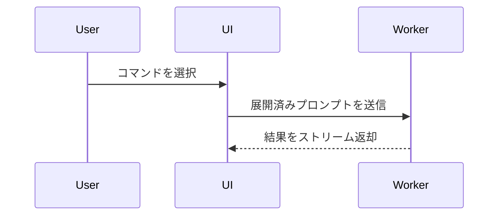

# Show Me

現在の論点を、読み手が一目で構造をつかめる形にする。前置きを置かず、図を先に出し、説明は短く保つ。最小の視覚化で要点が伝わる形式を1つ選ぶ。

## 形式の選び方

- **ロジック・アルゴリズム**: 疑似コード

```text
保存
  内容が変わっていない
    キャッシュ結果を返す
  新しい内容を書き込む
  新しい結果を返す
```

- **runtimeの制御フロー**: 呼び出し木

```text
submitForm
  createSession
    persistPrompt
    launchAgent
  navigateToSession
```

- **UI構造**: 状態と重要なモジュール境界を含むコンポーネント木

```tsx
<SessionPage> (apps/example/src/routes/session.tsx)
  useSessionEvents()
  <SessionToolbar>
    <RunSkillButton> (packages/ui)
```

- **ファイル責務・広いリファクタリング**: 浅いファイルツリー

```text
src/
├── commands/       # ユーザー操作を解釈
├── sessions/       # セッション状態を管理
└── transport/      # APIリクエストを送信
```

- **コンポーネント間の相互作用・処理順・データフロー**: Mermaid



- **何が変わるか**: diff。既存構造が大部分残る場合に使う

```diff
 <SessionPage>
   useSessionEvents()
   <SessionToolbar>
+    <RunSkillButton />
   <SessionTimeline>
+    <SkillResultCard />
```

- **Mermaidやテキスト図では情報量・レイアウトを表現しにくいUI**: 1枚のHTMLアーティファクト。実際のラベル・データ・対象プロダクトの色・余白・部品を使い、デスクトップとモバイルの両方を考慮する。作成後は絶対パスを報告し、ユーザーの明示依頼なしにブラウザを起動・操作しない。

- **システム全体像・多層アーキテクチャ・処理シーケンス・状態遷移**: `/archify`。ノードが8個を超える、層（設計時と実行時、SSOT と配布先など）が2つ以上ある、境界（リポジトリ・セキュリティ・リージョン）を描く必要がある、のどれかに当たるとき。手書きの表・カード列・Mermaid では関係が読み取れないので、テキスト図で妥協しない。

  典型的な誤りは、構造を問われて表やカードの一覧を出すこと。表は要素を数えるためのもので、要素同士の関係と方向は描けない。「全体像がわからない」と言われる出力はたいていこれ。

  実例: `docs/diagrams/harness.architecture.json`（このリポジトリ自身の配布アーキテクチャ）。

## 作成ルール

- 図には、論点に必要な呼び出し、ファイル、props、状態、境界だけを残す。関係ない詳細や想像上の要素を足さない。
- 実在するファイル名・関数名・状態名はそのまま使う。未確認の構造は作らず、必要なら `未確認` と示す。
- コードの説明では全文を貼らず、構造を示す最小の抜粋にする。ただし、ユーザーがコピー可能な対象形状を求める場合は、必要なブロック全体を出す。
- 図だけで意味が曖昧な場合に限り、図の直後に要点を1〜3行で補足する。
- 実装依頼と図解依頼を混同しない。図を作るだけの依頼では、コードや設定を変更しない。
- Mermaid以外の形式が指定されている場合は指定を優先する。形式指定がなく、図の種類で結果が大きく変わる場合だけ、Mermaid・テキスト図・HTMLのどれを望むかを1問で確認する。
- `/archify` を使う場合は、spec の JSON を成果物として残し、`validate`（showcase）→ `deliver` → `visual-check` を通してから報告する。検証を通していない HTML を完成として出さない。図の修正依頼は HTML ではなく spec に対して行う。

## 完了条件

- 最重要の関係または変化が、選んだ図に含まれている。
- 図の各要素が、確認済みの対象または明示した抽象化に対応している。
- 図を補う説明が必要な場合、その説明が図の読み方と結論だけに絞られている。
